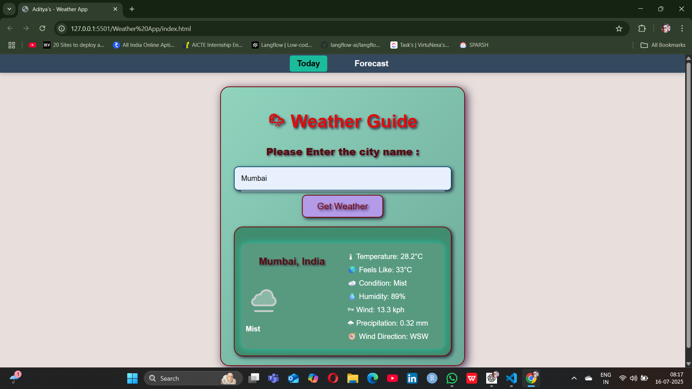
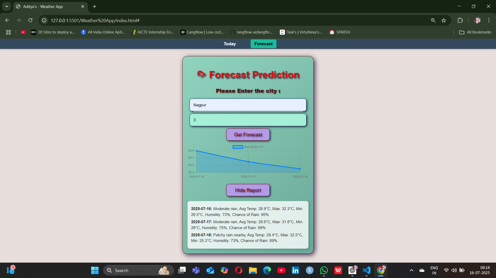

# 🌤️ WeatherBy by Aditya

A modern, responsive weather web app to display **today's weather** and a **1–3 day forecast** using the [WeatherAPI](https://www.weatherapi.com/). It features city auto-suggestions, forecast visualization using Chart.js, and a full report view — all inside a clean tabbed interface.

🔗 **Live Site:** [weatherybyaditya.netlify.app](https://weatherybyaditya.netlify.app)

---

## 📸 Screenshots




---

## 🚀 Features

- 🔍 City search with real-time **auto-suggestions**
- 🌡️ View **current weather** (temp, humidity, wind, etc.)
- 📊 **1–3 day forecast** with interactive **line chart**
- 📜 Expandable **text report** for detailed forecast
- 🎨 **Tabbed layout**, responsive design & animations
- ☁️ Powered by WeatherAPI & Chart.js

---

## 🧪 Technologies Used

- HTML5 & CSS3
- JavaScript (Vanilla)
- Chart.js (line chart)
- WeatherAPI (live weather data)
- Netlify (deployment)

---

## 📂 How to Run Locally

1. Clone this repository:
   ```bash
   git clone https://github.com/your-username/weather-forecast-app.git
   cd weather-forecast-app
2. Replace the API key in script.js:
   ```bash
   const apiKey = "YOUR_OWN_API_KEY";
3. Open index.html in your browser.


---
## ⚠️ API Key Note

This project uses a free WeatherAPI key in the frontend for demonstration purposes only.
If you're forking or using this project, please:

 >  Register at WeatherAPI.com

 >Replace the API key in script.js with your own

---
## 🛠 Deployment

 Deployed on Netlify:  https://weatherybyaditya.netlify.app

---
## 🙌 Acknowledgements

> WeatherAPI

>Chart.js

>Emojis from Open Source Unicode

---
## 👤 Author

#### Aditya Kumar Roy 
[](https://www.linkedin.com/in/adityaroy0804)
[](https://github.com/AdityaRoy0804)

---
## 📜 License
This project is open-source under the MIT License.

Feel free to fork, enhance, and share! 💖


